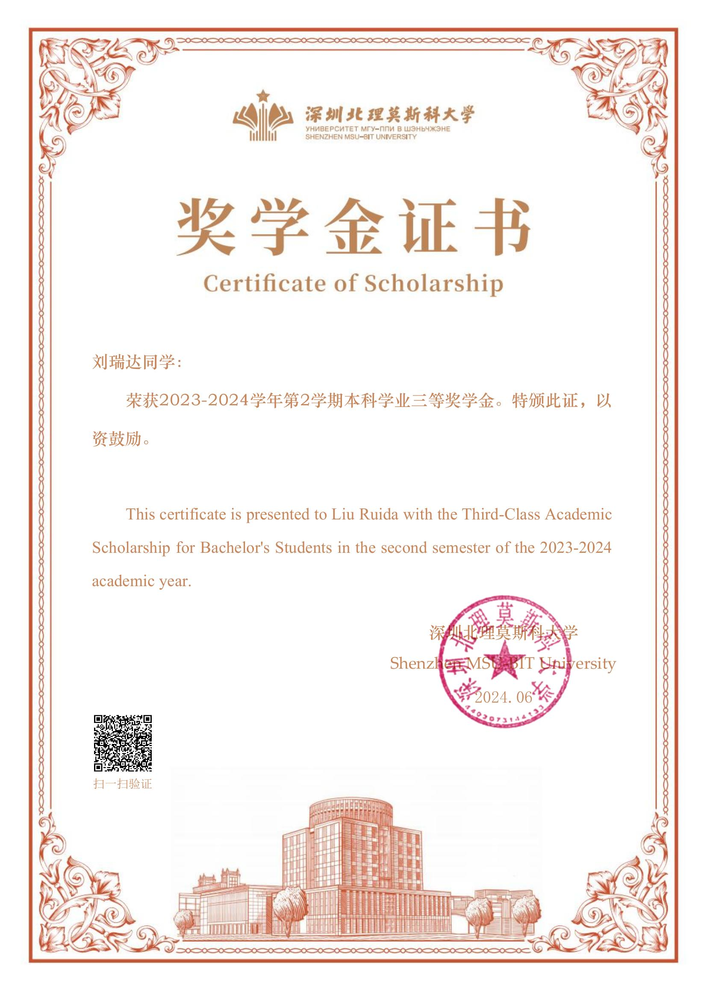
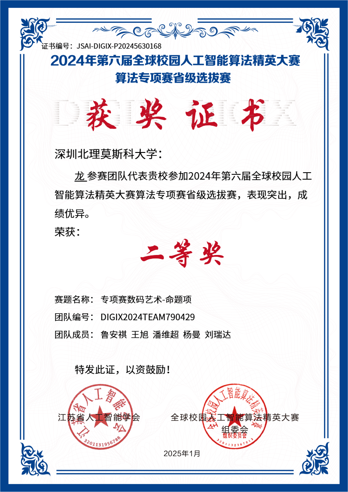
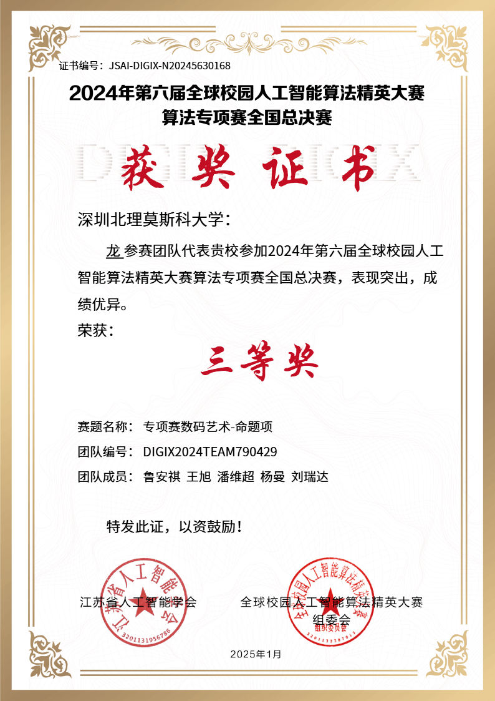
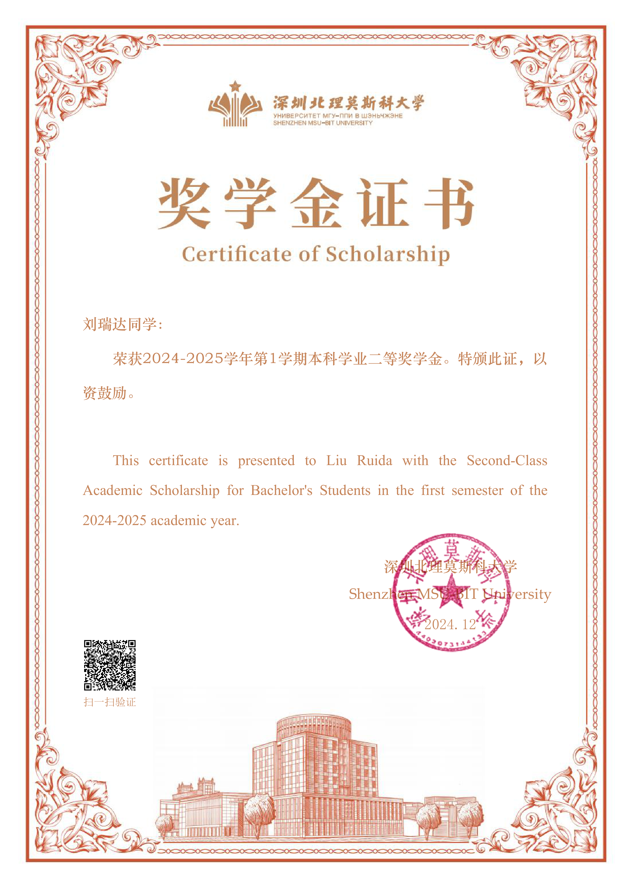
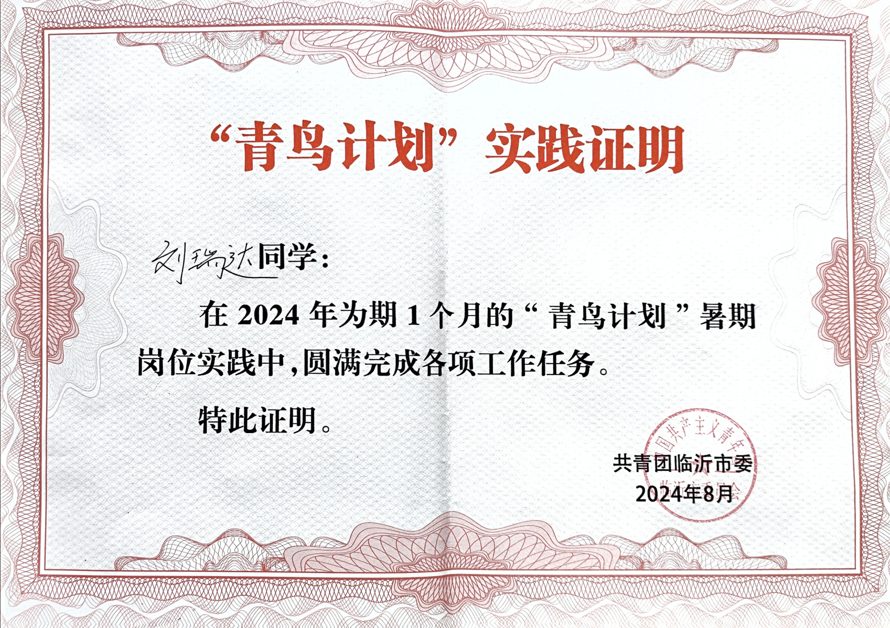
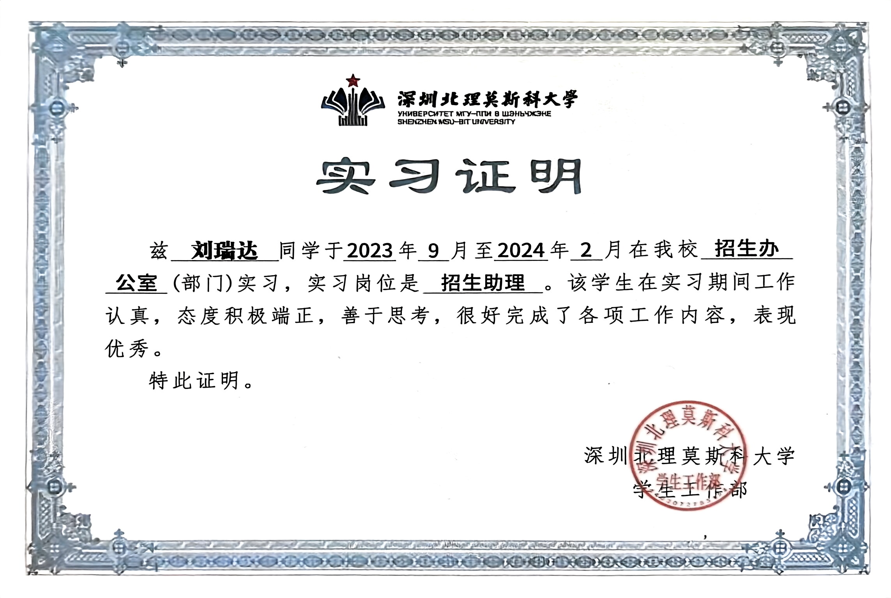

  

# Ruida Liu（刘瑞达）
欢迎联系我！

Wechat: SodokuL  ,  Email: soduku645@gmail.com
  
    

## 方向特长 Interests

  深度学习、机器学习、算法编程、平面设计 
  Deep Learning, Machine Learning, Algorithm Programming, Graphic Design

## 学业 Education

  🏫深北莫北理莫斯科大学 — <a href="https://www.smbu.edu.cn/xsjg/jssxykzx/yxjs.htm">计算数学与控制系</a> 本科在读 2023-2027（软科排名106）GPA 3.86/4 Top15% 
  <a href="https://www.smbu.edu.cn/index.htm"><b>Shenzhen MSU-BIT University</b></a> — <a href="https://www.smbu.edu.cn/xsjg/jssxykzx/yxjs.htm">Faculty of Computational Mathematics and Cybernetics</a>, Undergraduate 2023–2027 (Shanghai Ranking 106), GPA 3.86/4, Top 15%

  🏫莫斯科国立罗蒙诺索夫大学 — <a href="https://cs.msu.ru/en">计算数学与控制系</a> 本科在读 2023-2027（QS排名94）GPA 3.86/4 Top15% 
  <a href="https://msu.ru/"><b>Lomonosov Moscow State University</b></a> — <a href="https://cs.msu.ru/en">Faculty of Computational Mathematics and Cybernetics</a>, Undergraduate 2023–2027 (QS Ranking 94), GPA 3.86/4, Top 15%

  🧑‍🏫我现在师从深圳北理莫斯科大学<a href="https://ai.smbu.edu.cn/info/1251/1881.html">曾润浩教授</a>，任职研究助理(RA) 
  Currently studying under <a href="https://zengrunhao.com/index.html">Professor Runhao Zeng</a>, Shenzhen MSU-BIT University, serving as a Research Assistant (RA).

## 论文 Publications

  <a href="https://link.springer.com/chapter/10.1007/978-981-95-0030-7_4" class="notion-card" target="_blank">
    
    

      <h3>「CCF-C/ICIC2025/Oral/第二作者」SM-CBNet: A Speech-Based Parkinson’s Disease Diagnosis Model with SMOTE–ENN and CNN+BiLSTM Integration</h3>
      
点击跳转到论文界面

    

  </a>

- **SM-CBNet: A Speech-Based Parkinson’s Disease Diagnosis Model with SMOTE–ENN and CNN+BiLSTM Integration** (ICIC, CCF-C, Oral) 2025
  X. Wang, W. Pan, **R. Liu**, K. Jin and Z. Tian
  
  

  📄 摘要：帕金森病（PD）是一种常见的神经退行性疾病。我们提出了一种基于深度学习的语音诊断模型。针对数据不平衡问题，采用 SMOTE–ENN 方法，并构建了 CNN 与 BiLSTM 融合的混合架构，用于提取语音特征并建模时间序列关系。在公共数据集上，该模型准确率达到 95%，优于传统机器学习和其他深度模型。结果表明该方法在 PD 早期精准筛查中具有良好应用前景，可为临床提供可靠的技术支持。 
  
  📄 Abstract: Parkinson’s disease (PD) is a common neurodegenerative disorder. This study proposes a deep learning-based speech diagnostic model for PD. To address data imbalance, we apply SMOTE–ENN, and employ a hybrid CNN–BiLSTM architecture to extract acoustic features and model temporal patterns. Experiments on public datasets achieve 95% accuracy, surpassing traditional and other deep models. The results demonstrate the model’s effectiveness and its potential for accurate early PD screening in clinical settings.
  
  

## 奖项 Honors

### 名单内赛事-国奖🏆

  🥇 全国大学生物联网设计竞赛   国家一等奖（队长）  2025.5-2025.9 
  National University Student Internet of Things Design Competition (First Prize)

  🥉 蓝桥杯艺术设计赛  静态海报（命题）赛道   国赛三等奖（队长）  2025.2-2025.5 
  Blue Bridge Cup Art Competition Third Prize Nationally

  🥉 全球校园人工智能算法精英大赛算法专项赛   国家三等奖   2024.12-2025.1 
  Third Prize Nationally in the Global Campus AI Algorithm Elite Competition – Algorithm Track

### 名单内赛事-省奖🏆

  💻 蓝桥杯软件赛个人赛 Python B组   广东省赛二等奖   2025.4 
  Provincial Second Prize in the Blue Bridge Cup Python Competition (Individual)

### 其他奖项🏆

  🧠 全国算法精英大赛CCF CAT 全国Top30%（队长）  2025.5 
  National Algorithm Elite Competition Top 30%

  🎓 深圳北理莫斯科大学  奖学金两次 
  Two-time Recipient of SMBU Academic Scholarship

<!--
  

    📘 英语四级 
    CET-4 Certificate (College English Test, Band 4)

 -->
 
<!--

  🧮 中国大学生程序设计竞赛 CCPC（在投） 
  China Collegiate Programming Contest (CCPC) (Under Review)

    -->

  

  

    
    
    
    
    <!-- 再复制一轮，实现无缝衔接 -->
    
    
    
    
  

## 社团活动 Extracurricular Activities

  🎨 深圳北理莫斯科大学新媒体中心设计部部长 
  Head of Design Department, New Media Center, Shenzhen MSU-BIT University

  📐 深圳北理莫斯科大学数学建模协会骨干成员 
  Core Member, Mathematical Modeling Association, Shenzhen MSU-BIT University

  
  

## 项目 Projects

  <a href="https://mp.weixin.qq.com/s/UUB207kcCMzUx-u4nrESOg" class="notion-card" target="_blank">
    
    

      <h3>「独立原创」设计了深圳北理莫斯科大学学生会会徽，被使用至今</h3>
      
点击跳转至公众号推文

    

  </a>

## 其他经历 Else

  📌 2023年9月至2024年2月在深圳北理莫斯科大学招生办公室工作，任职「招生助理」。主持招生宣讲会议，招生信息数据整理等。 
  Worked at the Admissions Office of Shenzhen MSU-BIT University from September 2023 to February 2024 as an Admissions Assistant. Responsibilities included leading admissions presentations and organizing enrollment data.

  🏃 2024年6月至8月在临沂市体育局实习，任职「智能体育宣传推广助理」。管理市体育小程序后台，日常数据库维护与 Debug。 
  Interned at the Linyi Municipal Sports Bureau from June to August 2024 as an Assistant for Smart Sports Promotion. Responsible for managing the backend of the city's sports mini program, maintaining the database, and daily debugging.

  
  



