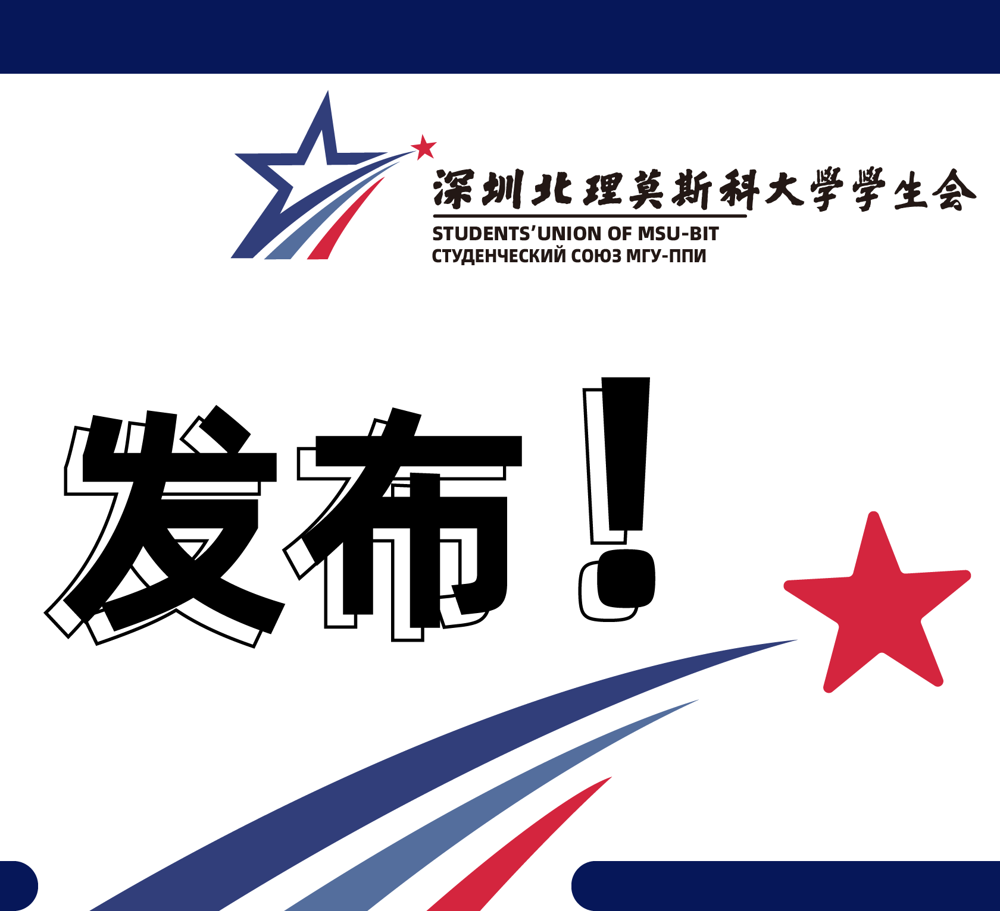

## 方向特长 Interests

深度学习、机器学习、算法编程、平面设计 
<b>Deep learning, Machine Learning, Algorithm Programming, Graphic Design</b>

## 学业 Education

🏫深北莫北理莫斯科大学 — <a href="https://www.smbu.edu.cn/xsjg/jssxykzx/yxjs.htm">计算数学与控制系</a> 本科在读 2023-2027（软科排名106）GPA 3.86/4 Top15% 
<b><a href="https://www.smbu.edu.cn/index.htm">Shenzhen MSU-BIT University</a></b> — Faculty of Computational Mathematics and Cybernetics, Undergraduate 2023–2027 (Shanghai Ranking 106), GPA 3.86/4, Top 15%

🏫莫斯科国立罗蒙诺索夫大学 — <a href="https://cs.msu.ru/en">计算数学与控制系</a> 本科在读 2023-2027（QS排名94）GPA 3.86/4 Top15% 
<b><a href="https://msu.ru/">Lomonosov Moscow State University</a></b> — Faculty of Computational Mathematics and Cybernetics, Undergraduate 2023–2027 (QS Ranking 94), GPA 3.86/4, Top 15%

🧑‍🏫我现在师从深圳北理莫斯科大学<a href="https://zengrunhao.com/index.html">曾润浩博士</a> 
<b>Currently studying under <a href="https://ai.smbu.edu.cn/info/1251/1881.htm">Dr. Runhao Zeng</a>, Shenzhen MSU-BIT University</b>

## 论文 Publications

- <b>SM-CBNet: A Speech-Based Parkinson’s Disease Diagnosis Model with SMOTE–ENN and CNN+BiLSTM Integration</b> (ICIC, CCF-C, Oral) 2025  
  X. Wang, W. Pan, <b>R. Liu</b>, K. Jin and Z. Tian

## 奖项 Honors

<ul class="tight-list">
  <li>全球校园人工智能算法精英大赛算法专项赛省二等奖，国家三等奖 
    <b>Second Prize in Guangdong Province and Third Prize Nationally in the Global Campus AI Algorithm Elite Competition – Algorithm Track</b>
  </li>
  <li>蓝桥杯软件赛个人赛 Python 广东省赛省二等奖 
    <b>Provincial Second Prize in the Blue Bridge Cup Python Competition (Individual)</b>
  </li>
  <li>深圳北理莫斯科大学奖学金两次 
    <b>Two-time Recipient of SMBU Academic Scholarship</b>
  </li>
  <li>英语四级 
    <b>CET-4 Certificate (College English Test, Band 4)</b>
  </li>
  <li>蓝桥杯艺术赛（在投） 
    <b>Blue Bridge Cup Art Competition (Under Review)</b>
  </li>
  <li>全国大学生物联网设计竞赛（在投） 
    <b>National University Student Internet of Things Design Competition (Under Review)</b>
  </li>
</ul>

  

    
    
    
    <!-- 再复制一轮，实现无缝衔接 -->
    
    
    
  

————————————————————————————————————————————————————————

## 社团活动 Extracurricular Activities

- 深圳北理莫斯科大学新媒体中心设计部部长
  
    **Head of Design Department, New Media Center, Shenzhen MSU-BIT University**
  
- 深圳北理莫斯科大学数学建模协会骨干成员
  
    **Core Member, Mathematical Modeling Association, Shenzhen MSU-BIT University**

## 项目 Projects

  <a href="https://mp.weixin.qq.com/s/UUB207kcCMzUx-u4nrESOg" class="notion-card" target="_blank">
    
    

      <h3>「独立原创」设计了深圳北理莫斯科大学学生会会徽，被使用至今</h3>
      
点击跳转至公众号推文

    

  </a>



